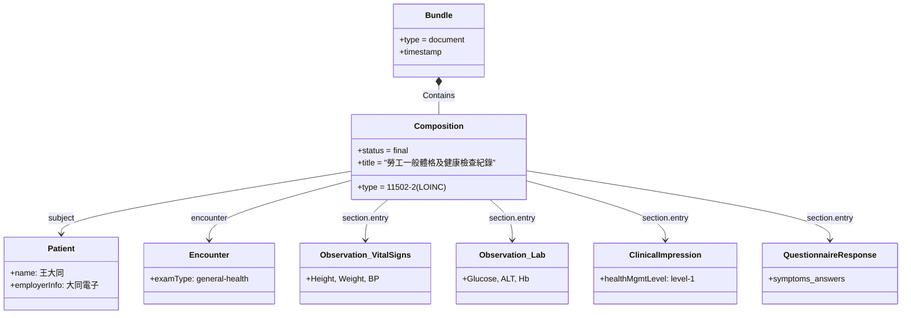

# 資料模型與 Resource 映射 (Data Model & Mapping)

本章節提供勞工一般檢查（附表十一）、特殊檢查（附表十）與健康服務紀錄（附表八）等資料欄位對應至 FHIR 資源（Resources）與 Profiles 的總體視圖。

---

## 1. 勞工健檢臨床文件 (Bundle & Composition) 關係圖

職業健檢紀錄在 FHIR 中是以一個完整的 **Document Bundle** 來呈現，結構如下：

---

## 2. 一般體格與健康檢查欄位映射表 (附表十一)

關於一般檢查項目的完整對應欄位，請參閱：
*   [一般檢查項目說明 (General Exam)](general-exam.html)：提供身高、體重、血壓、血液常規、尿液常規、生化檢驗（血糖、ALT、肌酸酐、血脂肪）等 LOINC 編碼與細節。

---

## 3. 特殊檢查項目欄位映射表 (附表十)

關於特別危害健康作業（第一版聚焦噪音、鉛、粉塵）之特殊項目，請參閱：
*   [特殊檢查項目說明 (Special Exam)](special-exam.html)：提供純音聽力圖、血中鉛、網狀紅血球、肺功能（FVC, FEV1）之檢驗對應與實作方式。

---

## 4. 臨場健康服務紀錄映射表 (附表八)

關於臨場醫護服務之申報與執行紀錄，請參閱：
*   [臨場服務紀錄說明 (Service Record)](service-record.html)：提供臨場服務就醫事件、辦理活動事項（Procedure）、發現問題（Observation）與改善追蹤（Task）之建模細節。

---

## 5. 醫師總評、健康分級與配工映射表 (第21條、第23條)

關於健檢後續之醫師總評、分級處置與配工，請參閱：
*   [健康管理分級與配工說明 (Health Management & Fitness for Work)](health-management.html)：詳細描述 `ClinicalImpression`、`CarePlan` 與 `ServiceRequest` 於一至四級健康管理中之協作關係。
