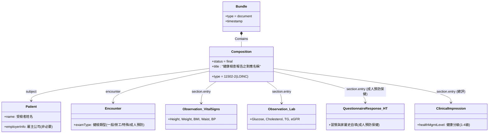

# 資料模型與 Resource 映射 (Data Model & Mapping)

本章節提供健康檢查資料交換（包含一般健康檢查、勞工健康檢查及成人預防保健）各欄位對應至 FHIR 資源（Resources）與 Profiles 的總體視圖。

---

## 1. 兩層架構資料模型關係圖
健康檢查資料交換依據兩層架構設計。以 `TWHA-Bundle` (type=document) 與 `TWHA-Composition` 為核心封裝文件：

---

## 2. Foundation Layer（全國共通核心）欄位映射
本層收錄各健康檢查最基本且共通之生理指標，其對應之 FHIR 資源及 Profiles 如下：

| 欄位群組 | 核心檢查項目 | 對應 FHIR Profile | 備註 / LOINC 代碼 |
|:---|:---|:---|:---|
| **Social History** (生活習慣) | 吸菸狀態 | `TWHASocialHistorySmokingProfile` | LOINC `72166-2` (Tobacco smoking status) |
| | 飲酒習慣 | `TWHASocialHistoryAlcoholProfile` | LOINC `11331-6` (History of Alcohol use) |
| | 嚼檳榔習慣 | `TWHASocialHistoryBetelNutProfile` | SNOMED CT `698188003` (Chews betel quid) |
| | 睡眠時間 | `TWHASocialHistorySleepProfile` | LOINC `93832-4` (Sleep duration) |
| **Vital Signs** (生理量測) | 身高 / 體重 | `TWHAVitalSignsProfile` | LOINC `8302-2` (Height), LOINC `29463-7` (Weight) |
| | 舒張壓 / 收縮壓 | `TWCoreBloodPressure` | LOINC `85354-9` (BP panel) |
| | 腰圍 | `TWHAVitalSignsProfile` | LOINC `56086-2` (Waist Circumference) |
| **Laboratory** (實驗室檢驗) | 空腹血糖 | `TWHALabResultGeneralProfile` | LOINC `1558-6` (Fasting Glucose) |
| | 總膽固醇 / 三酸甘油酯 | `TWHALabResultGeneralProfile` | LOINC `2093-3` (TC), LOINC `2571-8` (TG) |
| | HDL-C / LDL-C | `TWHALabResultGeneralProfile` | LOINC `2085-9` (HDL-C), LOINC `13457-7` (LDL-C) |
| | 尿蛋白定性 | `TWHALabResultGeneralProfile` | LOINC `5804-0` (Urine Protein) |
| **Screening** (篩檢與生理功能) | 視力及辨色力 | `TWHAVisionTestProfile` | LOINC `79880-1` (Vision test panel) |
| | 聽力篩檢 | `TWHAHearingTestProfile` | LOINC `89024-4` (Audiometry panel) |

---

## 3. Domain Supplement（領域擴充）欄位映射

### 3.1 勞工健康檢查 (Occupational Health Check)
*   **作業經歷與現職暴露**：使用 `TWHAOccupationProfile` 記錄職業別；使用 `TWHAWorkExposure` 記錄特別危害作業暴露年數。
*   **理學檢查**：使用 `TWHAPhysicalExamProfile` 記錄頭頸部、呼吸、心血管等七大系統醫師判定。
*   **特殊健檢指標**：使用 `TWHAPulmonaryFunctionProfile` 記錄肺功能檢驗值（FVC, FEV1）；使用 `TWHAECGProfile` 記錄心電圖；使用 `TWHALabResultSpecialProfile` 記錄血中鉛等特殊檢驗。
*   **自覺症狀**：使用 `TWHAQuestionnaireResponseProfile` 記錄附表十一所規定之勞工自覺症狀問卷。
*   **健康管理與配工**：使用 `TWHAClinicalImpressionProfile` 記錄醫師總評與 1-4 級分級；使用 `TWHACarePlanProfile` 與 `TWHAServiceRequestProfile` 記錄適性配工計畫與追蹤檢查開立。

### 3.2 成人預防保健 (Health Taiwan)
*   **個人與家族生活史自填問卷**：使用 `TWHAQuestionnaireResponseHTProfile` 記錄受檢者自填的吸菸、飲酒、嚼檳、規律運動、慢性病既往史（高血壓、糖尿病、高血脂、心血管疾病）與直系親屬家族史。
*   **SDOH 社會風險評估**：使用 `TWHASDOHQuestionnaireResponseProfile` (PRAPARE 問卷) 記錄受檢者之社會決定因素（如教育、就業、住房安全與財務狀況）。
*   **實驗室功能指標**：除基礎項目外，特別包含 **腎絲球過濾率 (eGFR)** 評估慢性腎臟病風險。
