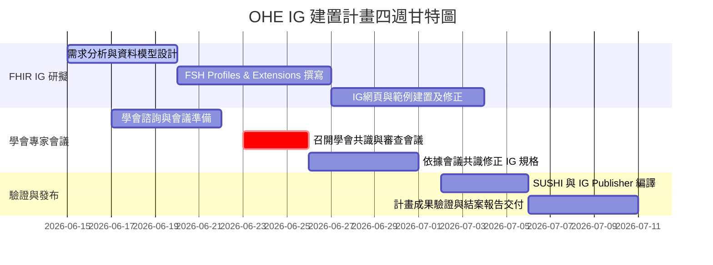

# 衛生福利部委託辦理「臺灣勞工職業健康體格及健康檢查實作指引 (OHE IG)」建置計畫書

> [!NOTE]
> 本計畫書為衛生福利部委託長庚醫療財團法人長庚紀念醫院執行之「臺灣勞工職業健康體格及健康檢查實作指引 FHIR Implementation Guide (OHE IG)」專案規劃。

---

## 一、 計畫背景與目的

根據我國《職業安全衛生法》與《勞工健康保護規則》，事業單位必須針對勞工實施一般體格檢查、健康檢查，以及針對特殊危害作業進行特殊健康檢查。目前相關健檢資料大多分散於各醫療機構與健檢中心，缺乏標準化的格式與傳輸機制，難以實現有效的跨機構資料交換、中央主管機關（衛福部、勞動部）的健康監測，以及企業臨場服務醫護人員的健康管理追蹤。

本計畫旨在透過國際醫療資料交換標準 **FHIR (Fast Healthcare Interoperability Resources) R4**，建置首版「臺灣勞工職業健康體格及健康檢查實作指引 (OHE IG)」，定義標準化的資料結構與傳輸機制，並與「臺灣核心實作指引 (TW Core IG v1.0.0)」無縫接軌。透過邀集職業醫學及相關健康管理學會共同研商，凝聚產官學研共識，以利未來推動全國勞工健檢資料之數位化標準交換。

---

## 二、 計畫基本資訊

* **委託單位**：衛生福利部 (MoHW)
* **受委託單位**：長庚醫療財團法人長庚紀念醫院 (CGMH)
* **計畫期程**：為期 4 週（4個星期）

---

## 三、 工作範疇與核心任務

本計畫主要工作內容分為三個面向：**FHIR IG 標準研擬與實作**、**專家共識與學會會議討論**、**成果驗證與指引發布**。

### 1. FHIR 實作指引 (Implementation Guide) 研擬與製作
* 依據《勞工健康保護規則》附表格式，定義以下資訊模型：
  * **行政與基本資訊**：勞工 (Patient)、醫事人員 (Practitioner)、事業單位/健檢機構 (Organization)、就醫/健檢事件 (Encounter)。
  * **生理與臨床檢查**：一般理學檢查 (Physical Exam)、生命徵象 (Vital Signs)、實驗室檢驗（一般及特殊項目）、肺功能檢查 (PFT)、心電圖 (ECG)、聽力檢查、視力檢查等。
  * **生活習慣與自覺症狀**：吸菸習慣 (Smoking)、嚼檳榔習慣 (Betel Nut)、飲酒、睡眠狀況，以及自覺症狀調查問卷。
  * **健康管理與評估**：健康管理分級 (Health Management Level)、適性配工建議 (Fitness for Work) 以及臨場健康服務執行紀錄（附表八）。
* 撰寫 FSH (FHIR Shorthand) 原始碼，產出符合國際標準之 Profiles、Extensions、ValueSets 與 CodeSystems。
* 撰寫 IG 說明網頁，包含資料模型說明、應用案例 (Use Cases) 以及實用範例 (Examples)。

### 2. 相關專業學會共識會議討論
* 邀集相關領域之專業團體進行標準審查與意見諮詢，確保實作指引符合臨床實務：
  * **中華民國職業衛生護理學會**
  * **台灣職業衛生服務學會**
  * **台灣職業醫學會**
  * 健檢與醫療資訊專家
* 舉辦專家共識會議，探討學會關切之議題（例如：嚼檳榔與吸菸量的精確度定義、肺功能 LOINC 代碼對齊、臨場服務紀錄的隱私性防護等）。

### 3. 指引編譯、驗證與交付
* 整合 TW Core IG v1.0.0 相依套件，解決本地 Terminology 離線編譯限制。
* 執行 HL7 IG Publisher 進行嚴格之語法驗證，產出 0 Error 之官方 QA 報告。
* 產出完整可運行的靜態指引網站。

---

## 四、 四週工作進度與里程碑 (Timeline)

由於期程僅有 4 週，專案將採取高強度的敏捷開發與會議同步機制：

### 【第一週：規格規劃與基礎模型建置】
* **工作重點**：
  * 盤點勞工一般健檢、特殊健檢（噪音、鉛、粉塵）以及臨場服務附表八之資料欄位。
  * 對齊 TW Core IG v1.0.0 繼承關係，規劃系統別名 (Aliases) 與核心 Extensions。
  * 啟動與各學會的會議聯繫與議程規劃。
* **里程碑**：完成 OHE IG 欄位對照表與初版資料模型設計。

### 【第二週：FSH 撰寫與專家共識會議】
* **工作重點**：
  * 撰寫核心 Profiles (如 OHEPatient, OHEECG, OHEOrganization, OHEPulmonaryFunction 等)。
  * **召開「勞工職業健康 FHIR 標準專家共識會議」**：邀請職業醫學會、職業衛生護理學會代表，審查欄位約束與 VS/CS 定義，達成產業實務共識。
* **里程碑**：召開專家共識會議並做成會議紀錄，完成 80% FSH 程式碼撰寫。

### 【第三週：學會共識導入與範例產出】
* **工作重點**：
  * 依據學會共識會議結論，修正 FSH 檔案（例如細化檳榔習慣 Extension、調整 Composition 結構）。
  * 撰寫健檢範例（一般健檢、噪音/鉛/粉塵特殊健檢等 Instance）。
  * 完成 IG 說明網頁（包含背景、使用案例、安全性考量等 MD 網頁）。
* **里程碑**：完成所有 FSH 檔案與應用範例，產出初版靜態指引草案。

### 【第四週：系統驗證、編譯與成果交付】
* **工作重點**：
  * 執行 `fsh-sushi` 進行語法編譯。
  * 執行 `HL7 IG Publisher` 產出完整網頁，排查 broken links 與 validation errors。
  * 彙整專案結案報告，交付衛生福利部。
* **里程碑**：指引網頁編譯成功（0 Error），交付計畫結案報告與原始碼封裝檔。

---

## 五、 預算編列與經費分配 (Budget)

本計畫預算總額為 **新臺幣 90 0,000 元**，經費編列明細如下：

| 預算科目 | 預算金額 (元) | 比例 (%) | 說明 |
| :--- | :---: | :---: | :--- |
| **一、人事費** | **450,000** | 50.0% | 包含專案主持人(1名)、協同主持人(1名)、FHIR 系統工程師(2名)之 4 週薪資與兼任助理津貼。 |
| **二、業務費** | **350,000** | 38.9% | |
| 　1. 專家審查與會議費 | *180,000* | *20.0%* | 舉辦 1 場大型專業學會共識會議之場租、餐點、專家出席費、交通費與審查費（邀請學會理監事及專家共 12-15 人）。 |
| 　2. 資訊耗材與系統建置費 | *120,000* | *13.3%* | 編譯伺服器租用、FHIR 驗證環境佈署、SSL 憑證、專利/代碼標準授權等。 |
| 　3. 雜支及印刷費 | *50,000* | *5.6%* | 報告書印刷、郵電、行政庶務等。 |
| **三、管理費** | **100,000** | 11.1% | 受委託機構（長庚醫院）之行政管理規費。 |
| **合計** | **900,000** | **100.0%** | |

---

## 六、 預期效益與交付成果

1. **臺灣勞工職業健康體格及健康檢查實作指引 (OHE IG) 靜態網站一套**：
   * 包含至少 35 個 Profiles、11 個 Extensions、15 個 ValueSets 及 10 個 CodeSystems。
   * 包含完整的一般與特殊危害健檢、臨場服務範例。
2. **學會共識會議紀錄與審查意見彙整表一份**：
   * 完整記錄職業醫學會、職業衛生護理學會等專家之具體修正建議與共識決議。
3. **專案結案報告書一份**：
   * 詳細記載開發過程、架構說明、驗證結果與未來推廣建議。
4. **提升國家勞工健康資料互通性**：
   * 本 IG 產出後，可供國內各健檢中心、職業衛生諮詢機構及企業資訊廠商參考，大幅降低未來申報與交換勞工健檢資料之介接成本，促進勞工健康促進政策之數位化發展。
